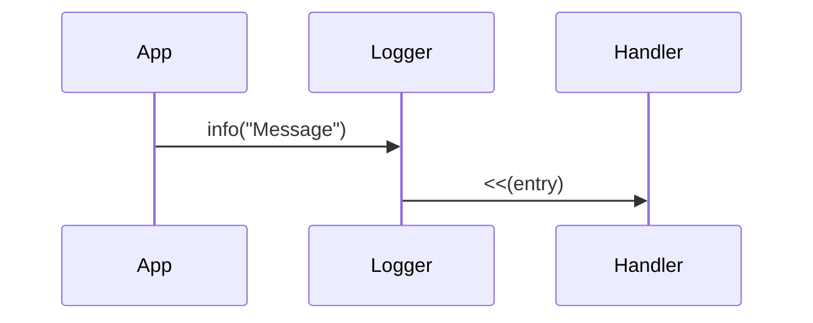

# 3. Decouple log generation from handling

Date: 2019-12-19

## Status

Accepted

## Context

We want the logging API used by applications to be consistent, while allowing for logs to be filed, forwarded, filtered and formatted in a variety of ways.

## Decision

De-couple generation of log message/entries from how they are handled.

* A `logger` object provides an API that can be used to generate log entries.
* Log "entries" are strongly typed structures.
* Log entry "handlers" provide a simple, consistent interface.

## Consequences

* We can plug in different "handlers" relatively easily.
