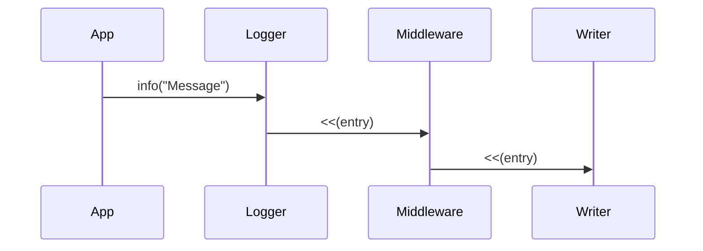

# 4. Use stacked handlers to solve many problems

Date: 2019-12-19

## Status

Accepted

## Context

GreenLog "loggers" push generated log "entries" to log "handlers".

Formatting/filing/forwarding logs in different ways is achieved by using a different handler.

However, there are some cross-cutting concerns that might apply regardless of the way log entries are formatted, stored or forwarded. For example:

- we may want to inject context into log entries (e.g. process id, thread name, trace id)
- we may want to "tee" log entries to multiple destinations
- we may want to buffer log entries in-memory and output/forward them asyncronously

## Decision

We will favour "stacking" handlers to solve such problems. That is:

* the source 'logger' will push entries to an intermediate handler
* the intermediate handler can
  - transform the input entries as required
  - forward them to one or more "downstream" handlers, as required
* handler "stacks" of arbitrary depth can be created

This approach is based on [Rack](https://github.com/rack/rack)'s "middleware" concept.

### Alternatives considered

I considered supporting "filters", which could take an `Entry` and return a transformed `Entry`, but that would not allow for:

* "tee-ing" the log to multiple destinations
* buffering or filtering of logs

## Consequences

* There will be many and various "middleware" handlers.
* Handler stacks could get deep.
